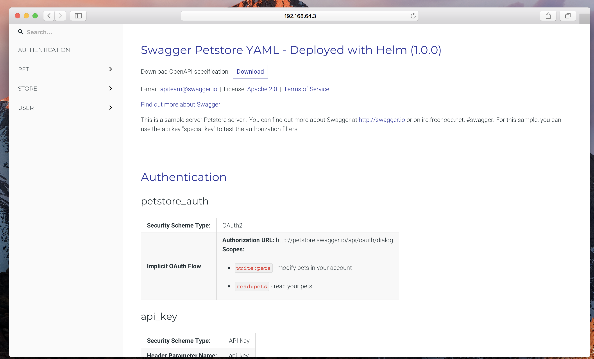

# Redoc helm example

This repo contains a simple example of how to deploy [redoc](https://github.com/Rebilly/ReDoc) with helm. 
It is based on the nginx helm chart and just copies ReDoc required configuration (from the `/data` folder) to a configmap.

Clone the repo locally, install it and you should be able to see the following page:

